<h1 align="center">laravel-ai-chat</h1>

<p align="center">
  <strong>The fastest way to ship a ChatGPT-style demo on Laravel 13, the official <a href="https://github.com/laravel/ai">laravel/ai</a> SDK, and Italian sovereign AI infrastructure.</strong><br/>
  React + <a href="https://ai-sdk.dev"><code>@ai-sdk/react</code></a> on the front, <a href="https://github.com/padosoft/laravel-ai-regolo"><code>padosoft/laravel-ai-regolo</code></a> as the default provider, five tool-driven artifact types (image · document · links · code · table) you can wire to your own data in minutes.
</p>

<p align="center">
  
  
  
  
  
  
  
</p>

> **Made with ☕ in Italy by [Padosoft](https://padosoft.com).** Sister projects: [`padosoft/laravel-ai-regolo`](https://github.com/padosoft/laravel-ai-regolo), [`padosoft/laravel-flow`](https://github.com/padosoft/laravel-flow), [`padosoft/eval-harness`](https://github.com/padosoft/eval-harness), [`padosoft/laravel-pii-redactor`](https://github.com/padosoft/laravel-pii-redactor), [`lopadova/AskMyDocs`](https://github.com/lopadova/AskMyDocs).

---

## Table of contents

1. [Why this demo](#why-this-demo)
2. [What's in the box](#whats-in-the-box)
3. [Architecture](#architecture)
4. [Tech stack](#tech-stack)
5. [Prerequisites](#prerequisites)
6. [Quick start (5 minutes)](#quick-start-5-minutes)
7. [Configuration reference](#configuration-reference)
8. [Try the demo — 5 prompts to start with](#try-the-demo--5-prompts-to-start-with)
9. [How the streaming works](#how-the-streaming-works)
10. [Adding a sixth artifact in 30 lines](#adding-a-sixth-artifact-in-30-lines)
11. [Switching to OpenAI / Anthropic / etc.](#switching-to-openai--anthropic--etc)
12. [Testing](#testing)
13. [Troubleshooting](#troubleshooting)
14. [Repo layout](#repo-layout)
15. [Roadmap](#roadmap)
16. [Contributing](#contributing)
17. [License & credits](#license--credits)

---

## Why this demo

You want a clean, opinionated reference for "how do I ship a streaming chatbot UI on Laravel?" without scrolling through fifteen blog posts. This repo answers it end-to-end, in the smallest amount of code that proves the wiring:

- **Streaming token-by-token** to a React UI using the official Vercel AI SDK protocol — same envelope the rest of the JS ecosystem speaks.
- **One-line provider swap** — Regolo is the default; flip an env var to talk to OpenAI, Anthropic, Mistral, Gemini, or Ollama with the same controller code.
- **Tools as inline artifacts** — pre-canned prompts trigger 5 demo tools that render their output as image cards, document cards, link lists, code blocks, and tables. Replace the stub data with your own to ship a real assistant.
- **Italian sovereign cloud out of the box** — `padosoft/laravel-ai-regolo` lets you keep prompts and customer data inside the EU (GDPR / EU AI Act friendly), in EUR-billed pay-as-you-go.
- **Junior-proof setup** — clone, copy `.env`, paste your Regolo key, run three commands, you have a working chat. No Docker, no Redis, no auth complexity.

If you want the heavy enterprise version (RAG, embeddings, citations, refusal logic, auth, audit log), see the sister project [`AskMyDocs`](https://github.com/lopadova/AskMyDocs). This repo is **deliberately minimal** — the 5-minute starter you fork to build your own.

## What's in the box

- `Laravel 13` SPA with a single React entry point (`resources/js/app.tsx`).
- Streaming controller `app/Http/Controllers/ChatStreamController.php` that calls `Agent::stream()->usingVercelDataProtocol()` and persists the assistant turn (with artifact metadata) on completion.
- 5 demo tools under `app/Ai/Tools/` — every one is a deterministic stub you can replace with a real data source:
  - `ShowImageTool` → image artifact (Picsum, seeded on the subject).
  - `ShowDocTool` → document card artifact (title + page count + snippet).
  - `ListLinksTool` → list of resource links (topic-specific demo set).
  - `CodeSnippetTool` → syntax-tagged code block with copy button.
  - `DataTableTool` → comparison/ranking table (default: top-5 Regolo models).
- React UI under `resources/js/` — `ChatApp.tsx`, `MessageThread`, `MessageBubble`, `Composer`, `SuggestedPrompts`, plus 5 artifact renderers under `components/artifacts/`.
- `useChatStream` hook in `resources/js/lib/use-chat-stream.ts` — wraps `@ai-sdk/react`'s `useChat()` with CSRF threading and the right request body shape.
- Tests:
  - `vendor/bin/phpunit` — 13 PHPUnit tests (controller validation, conversation persistence, tool stubs).
  - `npm run test` — 8 Vitest tests (artifact renderers, suggested prompts).
  - `npm run e2e` — 2 Playwright tests (smoke + intercepted streaming flow).
- This README, [`docs/IMPLEMENTATION_PLAN.md`](docs/IMPLEMENTATION_PLAN.md), `LICENSE` (MIT), `.env.example`.

## Architecture

```mermaid
flowchart LR
    subgraph Browser
        UI["React SPA<br/>@ai-sdk/react useChat()"]
    end

    subgraph Laravel["Laravel 13 (this repo)"]
        Route["POST /api/chat/stream"]
        Controller["ChatStreamController"]
        Agent["AnonymousAgent<br/>+ 5 Tools"]
    end

    subgraph SDK["laravel/ai SDK"]
        Stream["StreamableAgentResponse<br/>usingVercelDataProtocol()"]
    end

    subgraph Pkg["padosoft/laravel-ai-regolo"]
        Provider["RegoloProvider"]
    end

    subgraph Cloud["Italian sovereign cloud"]
        Regolo[("api.regolo.ai/v1")]
    end

    UI -->|"POST &#123;content, conversation_id&#125;"| Route
    Route --> Controller
    Controller --> Agent
    Agent --> Stream
    Stream --> Provider
    Provider -->|"chat/completions stream"| Regolo
    Regolo -.->|"SSE tokens + tool calls"| UI
    Stream -.->|"then() callback"| Controller
    Controller -.->|"persist messages + artifacts"| Controller
```



The browser sends one POST with the user message; the controller persists the user turn, builds an `AnonymousAgent` with the 5 tools and the conversation history, and returns the streamable response. The Vercel UI Message Stream is consumed by `@ai-sdk/react` directly — when the model decides to call `ShowImageTool`, the JSON output flows back as a `tool-output-available` part, the React layer parses the artifact payload, and the matching renderer mounts inline in the assistant bubble. After the stream closes, the `then()` callback persists the assistant message + artifact metadata so a refresh repopulates the thread.

## Tech stack

| Layer | Tech | Version | Why |
|------|------|---------|-----|
| Backend | PHP | `^8.3` | required by `laravel/ai` and Laravel 13 |
| Backend | Laravel | `^13.0` | LTS-class core, native session + CSRF |
| Backend | `laravel/ai` | `^0.6` | official, multi-provider AI SDK |
| Backend | `padosoft/laravel-ai-regolo` | `^0.2` | Regolo provider extension (default) |
| Database | SQLite | bundled | zero setup; demo conversations only |
| Frontend | React | `^18.3` | the lingua franca for AI chat UIs |
| Frontend | TypeScript | `^5.6` | strict mode catches the dumb mistakes |
| Frontend | `@ai-sdk/react` | `^3.0` | `useChat()` hook — Vercel AI SDK UI |
| Frontend | `ai` | `^6.0` | message stream protocol + transport |
| Frontend | Vite | `^7.0` | the Laravel default in 13 |
| Frontend | Tailwind | `^4.0` | the Laravel default in 13 |
| Test | PHPUnit | `^12` | feature + unit tests |
| Test | Vitest | `^2.1` | React component tests |
| Test | Playwright | `^1.49` | end-to-end smoke + streaming flow |

## Prerequisites

You need these on your machine **before** the quick start:

| Tool | Minimum | Where |
|------|---------|-------|
| **PHP** | `8.3` (CLI) | [windows/herd](https://herd.laravel.com) · [linux/mac/asdf](https://asdf-vm.com) · `apt install php8.3-cli` |
| **Composer** | `2.7+` | <https://getcomposer.org/download/> |
| **Node.js** | `20+` LTS | <https://nodejs.org/> · `nvm install 20` |
| **npm** | `10+` (ships with Node 20) | — |
| **A Regolo API key** | `rg_live_…` | <https://regolo.ai> → sign up → dashboard → **API keys** |

> **Heads up — Windows users.** Herd or [Laragon](https://laragon.org) makes PHP/Composer/Node work out of the box on Windows. Without one of those you'll need to add PHP and Composer to your `PATH` manually. The commands below work in both **PowerShell** and **bash** unless explicitly noted.

> **Don't have a Regolo key yet?** Sign up at <https://regolo.ai> — pay-as-you-go in EUR, free credit on signup, the demo runs with **less than €0.01** in usage.

## Quick start (5 minutes)

```bash
# 1. Clone
git clone https://github.com/padosoft/laravel-ai-chat.git
cd laravel-ai-chat

# 2. Install backend deps
composer install

# 3. Install frontend deps
npm install

# 4. Configure
cp .env.example .env
php artisan key:generate
# → open .env in your editor, set REGOLO_API_KEY=rg_live_...

# 5. Migrate the SQLite DB
php artisan migrate

# 6. Build the frontend (once, for production-style serving)
npm run build

# 7. Serve
php artisan serve
# → if `php artisan serve` says "Failed to listen (reason: ?)" on Windows/Herd,
#   use the bundled fallback router instead:
#       composer serve            # alias for the fallback below
#   or
#       php -S 127.0.0.1:8000 -t public public/_devserver.php
```

Open <http://localhost:8000> in your browser. You'll see the welcome screen with five suggested prompts. Click any of them — the chat streams Regolo's reply token-by-token and the matching artifact renders inline.

> **Iterating on the frontend?** Run `npm run dev` in a separate terminal instead of (or alongside) `npm run build`. Vite picks up your TSX changes with HMR; reload the browser to see them.

> **Don't want to type out the env vars by hand?** The `.env.example` already lists every key the demo reads — copy it as `.env` (step 4 above) and fill in only `REGOLO_API_KEY`. Everything else has sane defaults.

## Configuration reference

| Env key | Required | Default | Purpose |
|---------|:--------:|---------|---------|
| `APP_KEY` | ✅ | — (set by `php artisan key:generate`) | Session + cookie encryption. |
| `REGOLO_API_KEY` | ✅ | _empty_ | Regolo bearer token. Get it at <https://regolo.ai>. |
| `REGOLO_BASE_URL` | ⛔ | `https://api.regolo.ai/v1` | Override for staging or self-hosted. |
| `REGOLO_TEXT_MODEL` | ⛔ | `Llama-3.3-70B-Instruct` | Default chat model for streaming. Try `Llama-3.1-8B-Instruct` for cheaper / faster turns. |
| `AI_DEFAULT_TEXT` | ⛔ | `regolo` | Provider used when the controller calls `Agent::stream()` without an explicit name. Flip to `openai`, `anthropic`, etc. once those are configured. |
| `DB_CONNECTION` | ⛔ | `sqlite` | Demo uses SQLite; switch to `pgsql`/`mysql` for prod. |
| `SESSION_DRIVER` | ⛔ | `database` | The demo binds conversations to a session id from the cookie. |

Everything is also documented in `.env.example` — a junior dev should be able to copy it, fill the one required field, and run.

## Try the demo — 5 prompts to start with

The home screen shows five clickable suggestions, each wired to one tool. You can paste any of these into the composer too:

| Prompt | Triggers | Renders |
|--------|----------|---------|
| `Mostrami una foto del Colosseo al tramonto` | `ShowImageTool` | Inline image card (Picsum). |
| `Dammi un documento di esempio con un NDA breve` | `ShowDocTool` | Document card (title + page count + snippet). |
| `Linkami le risorse principali su Regolo.ai` | `ListLinksTool` | List of resource links with favicons. |
| `Mostrami uno snippet PHP che usa laravel/ai con Regolo` | `CodeSnippetTool` | Code block with language tag + copy button. |
| `Tabella dei top 5 modelli del catalogo Regolo` | `DataTableTool` | Sortable comparison table. |

Type your own questions and the model replies in plain text + Markdown — no tool call.

## How the streaming works

1. The user types a message; the React composer fires `chat.sendMessage({ text })` from `@ai-sdk/react`.
2. `useChatStream` reshapes the SDK request to `{ content, conversation_id }`, threads the `X-XSRF-TOKEN` header from the cookie, and POSTs to `/api/chat/stream`.
3. `ChatStreamController::store` validates, persists the user turn, builds an `AnonymousAgent` with the system prompt + history + 5 tools, and returns the streamable response from `Agent::stream()->usingVercelDataProtocol()->then(...)`.
4. The `usingVercelDataProtocol()` envelope — provided by `laravel/ai` itself, originally for Vercel AI SDK UI compat — emits `text-delta`, `tool-input-available`, `tool-output-available`, and `finish` events as the model streams tokens.
5. `@ai-sdk/react` parses the protocol on the client into `UIMessage.parts[]`. `MessageBubble` walks the parts:
   - `type === 'text'` → `<ReactMarkdown>`.
   - `type.startsWith('tool-')` and `state === 'output-available'` → JSON-parse `output`, dispatch via `__artifact` tag to the matching renderer in `components/artifacts/`.
6. When the stream finishes, the `then()` callback on the server fires with a `StreamedAgentResponse`; we persist the full assistant text + artifact metadata in the `messages` table so a page refresh restores the thread.

The Vercel UI Message Stream wire format is documented at <https://ai-sdk.dev/docs/ai-sdk-ui/stream-protocol> — `laravel/ai` implements it natively, no glue required.

## Adding a sixth artifact in 30 lines

Want a `MapArtifact`? It's three files:

1. **Backend tool** (`app/Ai/Tools/ShowMapTool.php`) — implement `Laravel\Ai\Contracts\Tool`, return JSON `{ "__artifact": "map", "lat": 41.89, "lng": 12.49 }`. Register it in `ChatStreamController::store` next to the others.
2. **React renderer** (`resources/js/components/artifacts/MapArtifact.tsx`) — embed an `<iframe>` to your favourite tile server.
3. **Dispatcher** (`resources/js/components/artifacts/index.tsx`) — add `'map'` to `ArtifactPayload`, route the case in `renderArtifact`.

Update the system prompt (`resources/views/prompts/system.blade.php`) so the model knows when to call the new tool, and you're done.

## Switching to OpenAI / Anthropic / etc.

`laravel/ai` ships with **15+ providers** built-in. To make the demo talk to OpenAI:

```bash
# .env
AI_DEFAULT_TEXT=openai
OPENAI_API_KEY=sk-...
```

That's it. The controller code doesn't change — `Agent::stream()` resolves whatever the `AI_DEFAULT_TEXT` env var points at. Same for `anthropic`, `gemini`, `mistral`, `groq`, `cohere`, `deepseek`, `bedrock`, `azure`, `openrouter`, `ollama`, `xai`, `voyageai`, `jina`, `eleven`. See [`config/ai.php`](config/ai.php) for the full list.

## Testing

```bash
# PHP — unit + feature
vendor/bin/phpunit

# Frontend — Vitest unit
npm run test

# Frontend — Playwright e2e (requires a one-time browser install)
npx playwright install chromium
npm run e2e
```

The Playwright e2e suite intercepts `/api/chat/stream` with a synthetic Vercel-AI-SDK-protocol response, so it runs offline without a real Regolo API key — perfect for CI.

## Troubleshooting

| Symptom | Why | Fix |
|---------|-----|-----|
| "Regolo API key not configured" / `401` from Regolo | `.env` value missing or didn't reload | set `REGOLO_API_KEY=rg_live_...` then `php artisan config:clear` |
| `419 PAGE EXPIRED` on the first POST | Test client / direct curl skipped the GET that sets the XSRF cookie | open `/` in the browser first; if you're calling from curl, do a `GET /` and reuse the `XSRF-TOKEN` cookie + `X-XSRF-TOKEN` header |
| `Class "Laravel\Ai\Agent" not found` | Composer install skipped or package conflict | `composer dump-autoload` then `composer install` |
| Blank page at `localhost:8000` | Vite manifest missing | run `npm run build` (production) or `npm run dev` (dev) |
| `SQLSTATE[HY000]: General error: 1 no such table: conversations` | Migrations didn't run | `php artisan migrate` |
| `permission denied` writing to `storage/` (Linux/macOS) | Default `storage/` perms | `chmod -R 775 storage bootstrap/cache` and ensure your user owns it |
| Frontend hot reload doesn't pick up `.tsx` changes | `npm run dev` not running | open a second terminal and run `npm run dev` alongside `php artisan serve` |
| `npm run e2e` hangs at "starting webServer" | `php artisan serve` failed silently — usually a missing migration or APP_KEY | run `php artisan migrate:fresh && php artisan key:generate` then retry |
| `php artisan serve` prints `Failed to listen on 127.0.0.1:XXXX (reason: ?)` | A known flake on some Herd / Windows setups where the artisan-spawned PHP server can't bind | use the bundled fallback: `composer serve` (or `php -S 127.0.0.1:8000 -t public public/_devserver.php`) |

Still stuck? Open an issue at <https://github.com/padosoft/laravel-ai-chat/issues>.

## Repo layout

```
laravel-ai-chat/
├── app/
│   ├── Ai/Tools/                      ← 5 demo tools (artifacts)
│   ├── Http/Controllers/ChatStreamController.php
│   └── Models/{Conversation,Message}.php
├── config/ai.php                      ← regolo provider + defaults
├── database/migrations/               ← conversations + messages
├── docs/IMPLEMENTATION_PLAN.md        ← full design doc
├── resources/
│   ├── css/app.css
│   ├── js/
│   │   ├── ChatApp.tsx
│   │   ├── app.tsx                    ← Vite entry
│   │   ├── components/{Composer,Message*,SuggestedPrompts}.tsx
│   │   ├── components/artifacts/      ← 5 artifact renderers
│   │   └── lib/use-chat-stream.ts     ← @ai-sdk/react adapter hook
│   └── views/{app,prompts/system}.blade.php
├── routes/web.php
├── tests/
│   ├── Feature/ChatTest.php           ← PHPUnit feature tests
│   ├── Unit/ToolsTest.php             ← PHPUnit tool stubs
│   └── e2e/chat.spec.ts               ← Playwright smoke + streaming
├── playwright.config.ts
├── vitest.config.ts
├── tsconfig.json
├── tailwind.config.js (CSS-only in Tailwind v4 — see resources/css/app.css)
├── vite.config.js
├── package.json
└── composer.json
```

## Roadmap

| Version | Status | Highlights |
|---------|--------|-----------|
| `v0.1` (this) | shipped | streaming + 5 artifact tools + 13 PHPUnit + 8 Vitest + 2 Playwright tests |
| `v0.2` | planned | conversation list sidebar, persisted thread navigation, dark mode |
| `v0.3` | planned | optional auth (multi-user demo with Sanctum SPA) |
| `v0.4` | exploring | RAG hookup using `lopadova/AskMyDocs` (sister project) |
| `v1.0` | tracking | pinned `laravel/ai` ^1.0 GA |

## Contributing

Contributions welcome — bug reports, new artifact tools, UI polish, docs improvements.

1. Fork, branch off `main`.
2. Run `vendor/bin/phpunit && npm run test && npm run typecheck` before pushing.
3. Open a PR with a clear description and (where it makes sense) a screenshot.

## License & credits

[MIT](LICENSE).

Built and maintained by **[Padosoft](https://padosoft.com)** as a runnable companion to [`padosoft/laravel-ai-regolo`](https://github.com/padosoft/laravel-ai-regolo) — the Regolo provider for the official `laravel/ai` SDK.

Sister packages in the Padosoft AI stack:

- [`padosoft/laravel-ai-regolo`](https://github.com/padosoft/laravel-ai-regolo) — Regolo provider, the default of this demo.
- [`padosoft/laravel-flow`](https://github.com/padosoft/laravel-flow) — saga / workflow orchestration.
- [`padosoft/eval-harness`](https://github.com/padosoft/eval-harness) — RAG + agent evaluation harness.
- [`padosoft/laravel-pii-redactor`](https://github.com/padosoft/laravel-pii-redactor) — PII redaction middleware for AI prompts.
- [`lopadova/AskMyDocs`](https://github.com/lopadova/AskMyDocs) — full-blown RAG chat / knowledge base on Laravel, the enterprise sibling.

---

<p align="center">
  <sub>Made with ☕ in Italy by <a href="https://padosoft.com">Padosoft</a>.</sub>
</p>
